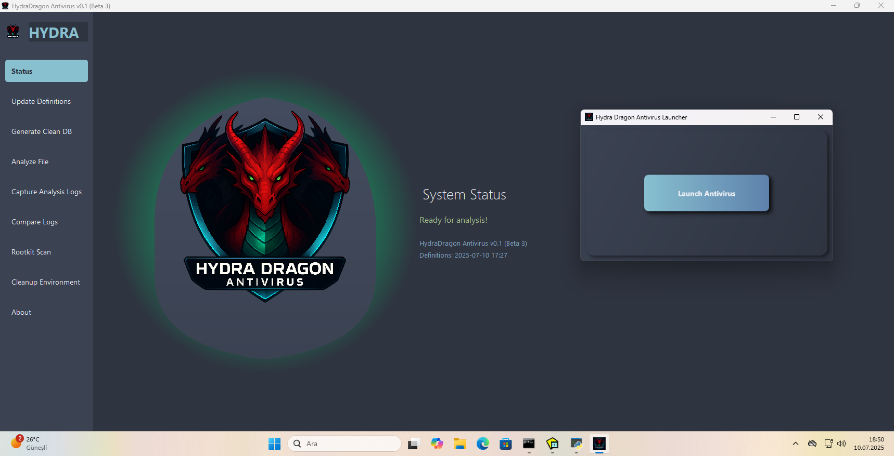

# Hydra Dragon Antivirus

## Description
Dynamic and static analysis with Real Time Protection for Windows, including EDR, ClamAV, YARA-X, machine learning AI, behavioral analysis, Unpacker, Deobfuscator, Decompiler, website signatures, Ghidra, Suricata, Sigma, and much more than you can imagine.

## License

This project is licensed under the **GNU Affero General Public License v3.0** (AGPLv3).  
See the [LICENSE](./LICENSE) file for more information.

## MEGA IMPORTANT AND !!!WARNING!!!
- You must uninstall it manually; the auto-uninstaller won’t work.
- The ClamAV update issue is temporary during setup; you can safely ignore it.
- Disable Secure Boot if the driver installation fails.
- We recommend waiting until the antivirus fully opens, even if some protections are already active.
- You can manually terminate the antivirus, but a virus cannot, because the antivirus driver can detect whether the request comes from a user or not. So don't worry if you managed to close it manually.
- Quarantine folder: C:\Program Files\HydraDragonAntivirus\Quarantine
- Pe header removed: https://www.virustotal.com/gui/file/9b7e921e971fe7523ba83a4599b4006ad214854eb043372129e4f5a68c5a427f
- Original: https://www.virustotal.com/gui/file/1ef6c1a4dfdc39b63bfe650ca81ab89510de6c0d3d7c608ac5be80033e559326
- So we ignore files looks like junk data (fully unknown)
- What is the difference and why does YARA still flag it as malware? Because your YARA rule doesn't check for unknown file types and I only removed the pe header and went to detections 0. So this god mode rule will save this antivirus right now!

## Download Machine Learning Malware And Benign Database
- **Malware Database:** [Download Link](https://drive.google.com/file/d/1QwdxdwX_nH-oF-5hVTkbTuFkrwUfR0-h)
- **Benign Database:** [Download Link](https://drive.google.com/file/d/12L1s4FC3tGmxhrzi_Q1VTgPy6l7S4Hwe) (outdated now I have 204k samples also I have javascript samples)
- **Note:** The collection only contains PE files smaller than 10MB. Due to my USB stick being broken and no longer recoverable, approximately 6,000 benign samples were lost forever. Some of these samples were even not available on VirusTotal.
- **Password:** infected

## Machine Learning Training Guide
- Install malicious (datamaliciousorder) and benign (data2) database, then install requirements.txt from train.py and just run train.py with the same folder as datamaliciousorder and data2.
- Then delete results.pkl and rename ml_definitions.pkl to results.pkl to consolidate the pickled data.

## Guide to compiling from source
- This very complex task. I need create wiki for that. Please contact me.

## Ghidra Source Code
- I now using 11.4.3: https://ghidra-sre.org/

## Java Development Kit
- Just look at https://www.oracle.com/java/technologies/downloads/#jdk21-windows

## Setup
- Setup file on release HydraDragonAntivirus.exe

## Ghidra
- Ghidra: %ProgramFiles%\aHydraDragonAntivirus\hydradragon\ghidra
- Ghidra Run: %ProgramFiles%\aHydraDragonAntivirus\hydradragon\ghidra\ghidraRun.bat
- Ghidra scripts: %ProgramFiles%\aHydraDragonAntivirus\hydradragon\scripts
 
 ## Sigma-HQ - Hayabusa
 - https://github.com/Yamato-Security/hayabusa/releases/tag/v3.7.0 (hayabusa-3.7.0-win-x64.zip)

 ## IMPORTANT
- Any logs will be removed when you restart the programme. So be careful!
- You have to restart the program after the analysis.
- Please don't share your IP in the logs.
- Make sure that the ClamAV database is installed without problems.
- We strongly recommend that you take a snapshot and then go back when you have finished your work.
- Make your username hydradragonav (for example and for avoid anti analysis).
- The installer also includes daily.cvd, main.cvd, bytecode.cvd due to download issues with the ClamAV database.

 ## Discord Community Server

- Here is the server link: https://discord.gg/Rdyw59xqMC

## Prepare environment
- Create too many files to detect ransomware.

## Guide

**Note 1:**.
- Allow Java on the Windows firewall, as it'll decompile the PE file.

**Note 2:**
- If you find an issue, please create an issue. Antivirus software might be triggered by website signatures because they are not obfuscated, so exclude the `%ProgramFiles%\aHydraDragonAntivirus\hydradragon` folder. Due to risks please only use in a VM.

**Note 3:**

- https://github.com/icsharpcode/ILSpy
- https://github.com/extremecoders-re/nuitka-extractor
- https://github.com/horsicq/Detect-It-Easy
- https://github.com/extremecoders-re/decompyle-builds
- https://github.com/mandiant/gostringungarbler
- https://github.com/cod3nym/Deobfuscar
- https://github.com/fesh0r/fernflower
- https://github.com/ViRb3/de4dot-cex
- https://www.rathlev-home.de/index-e.html?tools/prog-e.html#unpack 
- https://github.com/myfreeer/7z-build-nsis
- https://github.com/upx/upx
- https://github.com/syssec-utd/pylingual
- https://github.com/glmcdona/Process-Dump/releases/tag/v2.1.1
- https://github.com/lifenjoiner/ISx/releases/tag/v0.3.11
- https://github.com/nazywam/AutoIt-Ripper
- https://github.com/SychicBoy/NETReactorSlayer
- https://github.com/Veysel072/VMPUnpacker
- https://github.com/MadMin3r/UnconfuserEx
- https://github.com/LockBlock-dev/pkg-unpacker
- https://github.com/j4k0xb/View8
- https://github.com/HydraDragonAntivirus/MegaDumper 
- https://github.com/GuardianN06/SourceUndefender
- https://github.com/Lil-House/Pyarmor-Static-Unpack-1shot

- I used these projects to decompile (with a current custom database of Detect-It-Easy).

- https://github.com/starhopp3r/ML-Antivirus
- https://github.com/HydraDragonAntivirus/yarGen

- I used these projects for AI.

- https://github.com/HydraDragonAntivirus/Owlyshield
- https://github.com/HydraDragonAntivirus/Sanctum

- I used these projects for EDR.

- https://github.com/HydraDragonAntivirus/MBRFilter

- I used this project for MBR Protection.

- https://github.com/clamwin/python-clamav

- https://github.com/HydraDragonAntivirus/PYAS_Protection
- I used these projects to protect the antivirus.

- I used these projects to optimize the antivirus.

**Note 4:**.
- You will need an internet connection to install. It's not an offline installer.

**Note 5:**

- Don't forget to do a clean up, as it takes up too much space while processing files against ransomware, etc. 
- You need too much storage because it logs everything. 

**Note 6:**

- I have collected every malicious IP, domain from the Internet. So there must be big false positives, but I handle them.

**Note 7:**
- Inno Setup version 6.6.1

## Tips

**Tip 1:**

- Don't use suspicious VM names on your machine. (John Doe, etc.)

**Tip 2:**

- Use VSCode, VSCodium, or another editor to see live changes to .log files.

**Tip 3:**

- Close the Windows Firewall on the VM to avoid any firewall blocking. We are testing antivirus not Windows Firewall.

**Tip 4:**

- Try reset the container if malware tries to reboot the PC.

### FAQ:
**Does this collect data?**
- No. We can allow GridinSoft and many other companies to collect data. Unlike other companies, they freely allow the use of their cloud, but I'm not allowing that.

**How do I use it?**
- Just run the shortcut from the desktop, then run advanced dynamic and static analysis on a file.

**How good is it?**
- It's very good at static analysis, better than Dr.Web and Comodo, but Norton and Kaspersky are on par with my product at static analysis. In dynamic analysis, it is excellent at detecting unknown malware and clearly better than ClamAV in static analysis. ClamAV doesn't have dynamic analysis. It's the best Turkish and open source malware analysis product but it's very aggressive.

**Why does my antivirus detect this as malware?**
- It's a false positive. It's contains the website, HIPS signatures without obfuscation. It's a fully open source antivirus product.

**Why is it 2GB+?**
- Because of website signatures, Ghidra, ClamAV and Java Development Kit. Website signatures are not very effective but they can detect old and new viruses. I can remove them if you want. Ghidra is for decompiling but takes too much space. Java Development Kit is for Ghidra. That's 1GB+ Note that it's a completely local (except update database) and professional open source antivirus.

**Why does the antivirus.exe application take too long to run?**
- Sometimes you may have to wait 5+ minutes (or less) the first time you run the programme as a lot of things load.

**Which Windows versions are supported?**
- Windows 10 no longer offically supported. Switch to Windows 11 25H2.

**What are the minimum RAM and disk space requirements?**

- A minimum of 8 GB of RAM is required: 3 GB is used by ClamAV, and the remaining 5 GB is used by other engines.

**Any sponsors or supporters?**
- Yes, there are supporters for this project. Xcitium (Comodo) has expressed interest in supporting this project by providing malware samples, and Cisco Talos ClamAV community projects. But it's still a one man project.

**Are you using leaked YARA rules?**
- No we don't but if you have proof please create issue we can remove it.

**Why don't you use NictaSoft, GridinSoft and Bitdefender cloud?**
- It could significantly boost my antivirus. However, there are some problems. These services are not open source unless you pay. We're not only focused on detection, but also committed to maintaining open-source principles.

**Other related things?**
- I used yarGen to create machinelearning.yar.

**How many repositories did you look at for this project?**
- For YARA and website signatures, I looked at many projects-possibly more than 1,000.

**Why doesn't the program open?**
- Your installation might be broken. You can check the logs to determine the issue, because if the connection was lost during installation, it can affect the installation significantly. Try reinstalling to fix the problem.

### Credits:
- All credits goes to Emirhan Uçan (yes it's one man project)
- Thanks to Hacı Murad for collecting and compiling some machine learning signatures.

## Extraction and Decompilation Directories

This document describes all the output directories used by the malware analysis tool for various extraction, decompilation, and unpacking operations.

# HydraDragon Extraction & Decompilation Output — README

This document describes the output directories used by the HydraDragon analysis tool and what each directory contains. Keep this README next to the analysis output so analysts can quickly find decompiled/ extracted artifacts.

---

## How the output is organized

* Each extractor/decompiler writes into a dedicated directory under the analysis root.
* Tools create numbered subfolders (`1/`, `2/`, ...) to avoid overwrites when the same packer/result is processed multiple times.
* Filenames and subfolders are preserved where possible to make tracing back to the original artifact easier.
* Directories are created automatically by the extraction/decompilation modules.

---

## Top-level directory categories (quick reference)

* **Packer/Obfuscator extraction**: `hydra_dragon_dumper_extracted/`, `upx_extracted/`, `themida_unpacked/`, `vmprotect_unpacked/`, `debloat/`
* **.NET analysis**: `dotnet/`, `obfuscar/`, `de4dot_extracted/`, `net_reactor_extracted/`, `un_confuser_ex_extracted/`
* **Android/APK**: `jadx_decompiled/`, `androguard/`
* **Python**: `pyinstaller_extracted/`, `pyarmor8_and_9_extracted/`, `pyarmor7_extracted/`, `nuitka/`, `nuitka_extracted/`, `nuitka_source_code/`, `cx_freeze_extracted/`, `pylingual_extracted/`, `python_deobfuscated/`, `python_deobfuscated_marshal_pyc/`, `pycdas_extracted/`, `python_source_code/`
* **JavaScript / Node / Electron**: `webcrack_javascript_deobfuscated/`, `asar/`, `npm_pkg_extracted/`, `decompiled_jsc/`
* **Java**: `jar_extracted/`, `FernFlower_decompiled/`
* **Installer / archive**: `inno_setup_unpacked/`, `advanced_installer_extracted/`, `installshield_extracted/`, `zip_extracted/`, `seven_zip_extracted/`, `tar_extracted/`, `general_extracted_with_7z/`, `pe_extracted/`
* **Script decompilers**: `autohotkey_decompiled/`, `autoit_extracted/`
* **Go / Ungarbler outputs**: `ungarbler/`, `ungarbler_string/`
* **Misc / analysis artifacts**: `decompiled/`, `ole2/`, `memory/`, `resource_extractor/`, `html_extracted/`

---

## Detailed directory descriptions

(Each line shows directory name and the purpose of files found there.)

* `hydra_dragon_dumper_extracted/` — Hydra Dragon Dumper (Mega Dumper Fork) output extracted.
* `enigma1_extracted/` — Enigma Virtual Box extracted files.
* `decompiled/` — General decompiled files from miscellaneous tools.
* `upx_extracted/` — UPX (Ultimate Packer for eXecutables) extracted files.
* `webcrack_javascript_deobfuscated/` — JavaScript files deobfuscated with webcrack.
* `inno_setup_unpacked/` — Inno Setup unpacked installer files.
* `autohotkey_decompiled/` — AutoHotkey script decompiled outputs.
* `themida_unpacked/` — Themida unpacked outputs.
* `nuitka/` — Nuitka onefile extracted directory.
* `ole2/` — OLE2 extracted resources and compound file structures.
* `dotnet/` — .NET decompiled sources.
* `jadx_decompiled/` — APK decompiled with JADX (Java sources).
* `androguard/` — APK decompiled output from androguard (smali/java).
* `asar/` — ASAR (Electron) archive extracted contents.
* `npm_pkg_extracted/` — NPM package extraction (JavaScript bundles).
* `decompiled_jsc/` — V8 / JSC bytecode objects and decompiled artifacts.
* `obfuscar/` — .NET assemblies obfuscated with Obfuscar.
* `de4dot_extracted/` — .NET files deobfuscated using de4dot.
* `net_reactor_extracted/` — .NET Reactor Slayer outputs.
* `un_confuser_ex_extracted/` — UnConfuserEx deobfuscation outputs.
* `pyinstaller_extracted/` — PyInstaller onefile extraction results.
* `pyarmor8_and_9_extracted/` — PyArmor 8/9 unpacked outputs.
* `pyarmor7_extracted/` — PyArmor 7-specific unpacking outputs.
* `cx_freeze_extracted/` — cx_Freeze `library.zip` contents extracted.
* `pe_extracted/` — PE file internals and extracted sections/resources.
* `zip_extracted/` — ZIP archive contents.
* `seven_zip_extracted/` — 7-Zip archive contents.
* `general_extracted_with_7z/` — General extraction area for 7-Zip operations.
* `nuitka_extracted/` — Nuitka binary outputs and support files.
* `advanced_installer_extracted/` — Advanced Installer extraction outputs.
* `tar_extracted/` — TAR archive contents.
* `memory/` — Dynamic analysis memory dump files (.dmp / raw memory dumps).
* `resource_extractor/` — RCData and embedded resources extracted by resource extractor.
* `ungarbler/` — Deobfuscated Go (garble) binaries and output.
* `ungarbler_string/` — Deobfuscated strings from Go Garble outputs.
* `debloat/` — Debloated files directory (trimmed installers/binaries).
* `jar_extracted/` — Extracted contents of JAR files.
* `FernFlower_decompiled/` — JARs decompiled with FernFlower.
* `pylingual_extracted/` — pylingual-reversed Python sources (.pyc -> .py).
* `vmprotect_unpacked/` — VMProtect unpacked directories.
* `python_deobfuscated/` — Deobfuscated Python sources.
* `python_deobfuscated_marshal_pyc/` — Deobfuscated .pyc from marshal blobs.
* `pycdas_extracted/` — pycdas / Decompyle++ extracted Python sources. ( 21-Oct-2025)
* `python_source_code/` — Extracted and organized Python project sources.
* `nuitka_source_code/` — Nuitka reversed-engineered source tree.
* `html_extracted/` — HTML and web page resources captured during analysis.
* `installshield_extracted/` — InstallShield unpack outputs.
* `autoit_extracted/` — AutoIt script extraction results.

---

## Usage & Best practices

* Inspect each extraction directory after the run to locate configuration blobs, embedded resources, strings, and suspicious binaries.
* If you need to regenerate extracted outputs, run the relevant extractor again; numbered subfolders prevent accidental overwrites.

---

## Troubleshooting

* If a directory is empty, check the corresponding extraction log for errors. Tools may fail silently if binaries are corrupted.
* If references look malformed (e.g. `Unknown.0,Unknown`), run the provided `reference_fix_and_rebuild.py` to normalize and rebuild references.
* If the loader is slow, enable shard caching or batch queries (see loader docs) rather than re-loading every shard for each lookup.

---

## Contact

For changes to this README or to add new extractor directories, update this file and check it into your repo so everyone can see the mapping.
