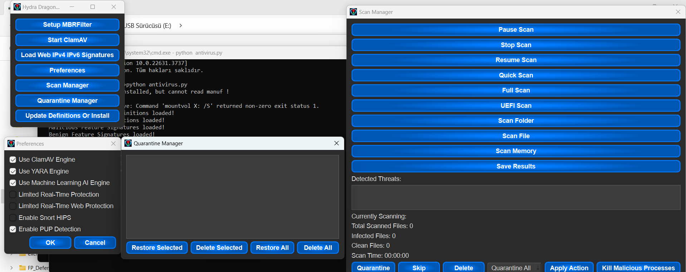

# Hydra Dragon Antivirus

Dynamic and Static Analysis with Sandboxie for Windows with ClamAV, YARA-X, my machine learning AI, Behaviour analysis, NLP-Based detection, website signatures, Ghidra and Snort etc.

## Download Machine Learning Malware And Benign Database
- **Malware Database:** [Download Link](https://drive.google.com/file/d/1QwdxdwX_nH-oF-5hVTkbTuFkrwUfR0-h)
- **Benign Database:** [Download Link](https://drive.google.com/file/d/1JXcTVB205tJXqNmFWmnAiy1br_hn19Rj)
- **Note:** Only contains PE files.
- **Password:** infected

## Machine Learning Training Guide
- Install malicious (datamaliciousorder) and benign (data2) database, then install requirements.txt from train.py and just run train.py with the same folder as datamaliciousorder and data2.

## Guide to compiling from source
- You can compile YARA-X and YARA from the yara folder. The website database is not a complication. See the machine learning training guide to compile machine learning database. To compile antivirus.py install requirements.txt and use assets/HydraDragonAV.png then use buildcxfreeze.txt arguments and change based on your installed folder of HydraDragonAntivirus. After compiling cx_Freeze with python 3.11, Machine Learning, YARA then look at the compiler.iss and replace the code with your installed environment, you can find other files in repo like hydradownload folder and then compile it. It's done! Now you are ready to release your fork of HydraDragonAntivirus.

## Ghidra Source Code
- I now using 11.2.1: https://ghidra-sre.org/

## Java Development Kit
- Just look at https://www.oracle.com/java/technologies/downloads/#jdk23-windows

## Setup
- Setup file on release HydraDragonAntivirus.exe

## Logs
- You must look warnining at logs. They usually contain malware detections. Log file in C:\Program Files\HydraDragonAntivirus\log\antivirus.log 

## Ghidra
- Ghidra: C:\Program Files\HydraDragonAntivirus\ghidra
- Ghidra Run: C:\Program Files\HydraDragonAntivirus\ghidra\ghidraRun.bat
- Ghidra log: C:\Program Files\HydraDragonAntivirus\ghidra_logs\analyze.log
- Ghidra projects : C:\Program Files\HydraDragonAntivirus\ghidra_projects
- Ghidra scripts: C:\Program Files\HydraDragonAntivirus\scripts
 
 ## IMPORTANT
 - Any ghidra project will be removed after you restart the program. So be careful!
 - Don't forget to clean up commandlineandmessages, zip_extracted, etc. dirs, sandboxie dirs before analysis. Or take a snapshot before you running the program.
 - You have to restart the program after the analysis.
- Please don't share your IP in the logs.
- Make sure that the ClamAV database is installed without problems.

## Discord Community Server

- Here is the server link: https://discord.gg/Rdyw59xqMC

## Prepare environment
- Create DefaultBox in Sandboxie and create too many files to detect ransomware, finally use UEFI and GPT.

## Guide

**Note:** 
- You need to create a DefaultBox in Sandboxie by running it once with a random application.  Also, please clean the DefaultBox items each time you scan. 
- Please don't open the log file while the malware analysis is running, as it may trigger the anti-virus if you didn't remove the log before and the previous sample was detected before.

**Note 2:** 
- You must run ghidra before you run Hydra Dragon Antivirus. To run ghidra, simply open this file:  C:\Program Files\HydraDragonAntivirus\ghidra\ghidraRun.bat

**Note 3:**.
- Allow Java on the Windows firewall, as it'll decompile the PE file.

**Note 4:**
- The update can take up to 5 minutes (10 seconds depending on your internet speed) or more, and will happen if you open this application after 6 hours, as it updates ClamAV definitions. Wait until you receive an update message. You can view freshclam.exe in the Task Manager under Hydra Dragon Antivirus. It will also restart ClamAV after definitions then give you a message. It's not well tested. If you find an issue, please create an issue. Antivirus software might be triggered by website signatures because they are not obfuscated, so exclude the `C:\Program Files\HydraDragonAntivirus` folder. Please only use in a VM as you can only use this for deep analysis of a file. There is no fixed analysis time for a file.

**Note 5:**

- https://github.com/icsharpcode/ILSpy
- https://github.com/extremecoders-re/nuitka-extractor
- https://github.com/horsicq/Detect-It-Easy

- I used these projects to decompile.

- https://github.com/starhopp3r/ML-Antivirus
- https://huggingface.co/meta-llama/Llama-3.2-1B

- I used these projects for AI.

**Note 6:**.
- You will need an internet connection to install. It's not an offline installer.

**Note 7:**.

- Test that ilspycmd.exe works on your machine because you need to install .NET 6.0 Runtime which some machines don't have.

**Note 8:**

- Don't forget to do a clean up, as it takes up too much space while processing files against ransomware, etc. 
- You need too much storage because it logs everything. 

**Note 9:**

- I have collected every malicious IP, domain from the Internet. So there must be big false positives, but I handle them.

**Note 10:**
- I added en_core_web_md manually to C:\Program Files\HydraDragonAntivirus you can find the spacy path from codechecker\spacyfind.py but you need to rename en_core_web_md folder name which contains config.cfg for an example if version 3.7.1 then it contains a subfolder en_core_web_md.3.8.0 
- Also you need run "spacy download en_core_web_md"

**Note 12:**

- Your Windows folder must be in C:\ because some codes are hard coded.

**Note 13:**

- If you are testing a rootkit, please enable "bcdedit testsigning on" to allow the rootkit to run on your machine for analysis.

## Tips

**Tip 1:**

- Don't use suspicious VM names on your machine. (victim, etc.)

**Tip 2:**.

- Use VSCode, VSCodium or another editor to see live changes to .log files

**Tip 3:**.

- Close the Windows Firewall on the VM to avoid any firewall blocking.

## Internet Access In Sandboxie
- HIPS detection shouldn't work if you don't open the Internet in Sandboxie. To enable it go to: Sandbox -> DefaultBox -> Sandbox Settings -> Restrictions -> Internet Access -> Click "BLock All Programs" then click "Allow All Programs" then save it and you're done!.  https://sandboxie-plus.com/sandboxie/restrictionssettings/

### FAQ:
**Does this collect data?**
- No.

**How do I use it?**
- Just run the shortcut from the desktop, then run advanced dynamic and static analysis on a file.

**How good is it?**
- It's very good at static analysis, better than Dr.Web and Comodo, but Norton and Kaspersky are better than my product at static analysis. In dynamic analysis, it is excellent at detecting unknown malware and clearly better than ClamAV in static analysis. ClamAV doesn't have dynamic analysis. It's the best Turkish and open source malware analysis product but it's very aggressive.

**Why does my antivirus detect this as malware?**
- It's a false positive. It's a one-file compiled cx_Freeze file and contains the website, HIPS signatures without obfuscation. It's a fully open source product.

**Why is it 5GB+?**
- Because of website signatures, Ghidra, ClamAV and Java Development Kit. Website signatures are not very effective but they can detect old and new viruses. I can remove them if you want. Ghidra is for decompiling but takes too much space. Java Development Kit is for Ghidra. That's 1GB+, but Llama3.2-1B and cx_Freeze (transformers, torch modules etc.) make a total of 5GB+. Note that it's a completely local and very professional open source antivirus.

**I get unexpected errors when using compiled YARA-X rules.**
- I don't usually encounter this problem, please create an issue.

**Why does the antivirus.exe application take too long to run?**
- Sometimes you have to wait 30+ minutes (it can go up to 2 hours) when you run the program for the first time because a lot of things are loading, but this only happens on the first run.

**Supported Windows versions?**
- Windows 10 64-bit and Windows 11 only (you can run ClamAV, but you can't run HydraDragonAntivirus on Windows 8.1 and it's not supported). If you want, I can create a 32-bit version for Windows 10 32-bit, but I faced some problems. ClamAV has limitations on 32-bit, so it's problematic. On Windows 8.1, ClamAV isn't supported because it's an outdated Windows version. You will get the `api-ms-win-crt-runtime-l1-1-0.dll` error. Even if you add this DLL, you will get another error: "Application failed to start properly (0xc000007b)." Then install this: [Microsoft VC Redist](https://learn.microsoft.com/en-us/cpp/windows/latest-supported-vc-redist?view=msvc-170). After running `C:\Program Files\ClamAV\freshclam.exe` and `clamd.exe` with `clamd --install`, the setup is complete, but you can't run HydraDragonAntivirus on Windows 8.1 because you get an ImportError on line nine due to PySide6.

**Minimum RAM?**
- 8GB RAM is the minimum because I am using Llama3.2-1B locally. I strongly recommend 8GB RAM.

**Any sponsors or supporters?**
- Yes, there are supporters of this project. Xcitium (Comodo) has expressed interest in supporting this project by sending malware samples, and Cisco Talos ClamAV community projects.