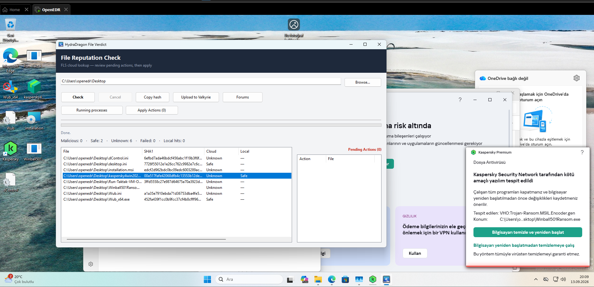
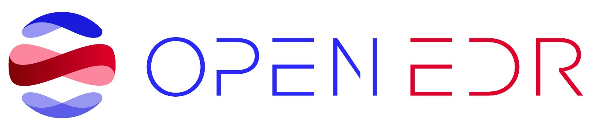

# Hydra Dragon Antivirus

  

  

  📚 For detailed documentation, architecture diagrams, and component guides, visit our <a href="https://github.com/HydraDragonAntivirus/HydraDragonAntivirus/wiki">Project Wiki</a>.

  

  

  

<h1 align="center" style="color: red;">
    WARNING: ACTIVE DEVELOPMENT IN PROGRESS  
</h1>

This project is not production-ready.
Breaking changes, bugs, and incomplete features should be expected.

⚠️ NOTICE: This repository is intended strictly for EXPERT MALWARE ANALYSTS and SECURITY RESEARCHERS. 
It contains low-level system components and experimental security drivers that require professional knowledge to handle safely.

> [!CAUTION]
> ### 🛑 USER LIABILITY & SAFEGUARD LIMITATIONS
> HydraDragon is designed to protect against **malicious automated threats**, not human error or intentional system modifications.
>
> 1. **Manual Deletion**: The antivirus **WILL NOT** stop you from running commands like `rd C: /s /q` or manually deleting your own files. It recognizes that if you (the Administrator) are explicitly deleting something, it is a **real user mistake** rather than a malware intrusion. The system is designed to permit intentional administrative decisions without interference.
> 2. **Driver/System Misconfiguration**: The software does not protect against manual installation of incompatible drivers or incorrect system settings. A "Inaccessible Boot Device" or other system failures caused by manual registry edits or driver experiments are **NOT** considered malware behavior and are not blocked.
> 3. **Experimental Nature**: You are responsible for any data loss or system instability caused by using this experimental software. **Always test in a Virtual Machine (VM) first.**

## One Man Project

- HydraDragon is a three-year independent open-source antivirus/EDR project built primarily by one developer.

## TODO
- Add HydraDragonIDE to project (static analyzer).
- Remove Npcap since it's not really open source and replace with custom Suricata build.

## Compatibility with PCs

- **Platform Support**: This project is strictly for **x86-64 Windows** only. aarch64 and other architectures are not supported.
- This installer is designed to be used on clean or freshly formatted Windows PCs.

- For best results, install HydraDragon Antivirus only on systems where the required third-party components have not already been installed manually.

### Important Notice

Please do not run this installer if any of the following programs are already installed on your PC:

- Python 3.12
- Node.js
- Npcap
- ClamAV
- Suricata
- OpenEDR or related EDR components

Installing HydraDragon Antivirus on a system where these components are already installed may cause version conflicts, path issues, service conflicts, or unexpected installer behavior.

### Recommended Usage

Use this installer on:

- Fresh Windows installations
- Clean test machines
- Virtual machines
- PCs without existing antivirus engine dependencies

If you already have any of the required components installed, uninstall them first or use a clean Windows environment before installing HydraDragon Antivirus.

## Important Notes & Limitations

### Project Scope

HydraDragon is a local antivirus (except Xcitium cloud) project currently under active and experimental development.

- It operates locally on the system.
- It is intended for research, learning, and malware analysis experimentation.

This project does not aim to replace your primary daily antivirus solution.

---

### Detection Philosophy

- False positives may occur.
- The system assumes the machine is in a clean state (not post-infection).
- The project prioritizes deeper analysis over speed.
- The goal is long-term detection improvement rather than quick but shallow detection.
- This does NOT mean the project achieves a 99% detection rate — it reflects the development philosophy only.
- This antivirus not only uses his best signatures but almost every new signatures. That's why it's heavy.

---

### Experimental Status

- This is a highly experimental project.
- Some architectural decisions in earlier versions were not optimal and affected stability.
- The project is actively being improved and refined.
- Use with caution.

---

### Sample Detection Policy

- Very old malware samples may not be detected.
- Signature retirement reference:
  https://blog.clamav.net/2025/12/clamav-signature-retirement.html

- **Boot-Critical Filters**: `MBRFilter` is now configured as a **SERVICE_BOOT_START (0)** UpperFilter. This ensures the Master Boot Record is protected from the very first moment the disk stack initializes, providing hardware-level resistance against bootkits and Petya-style ransomware.
- Files that appear as junk or fully unknown data may be ignored intentionally.
- If a PE header is removed, some detection engines may no longer flag the file.
- YARA detections may still trigger depending on rule logic (for example, rules that do not verify file type).

Example:

PE header removed sample:
https://www.virustotal.com/gui/file/9b7e921e971fe7523ba83a4599b4006ad214854eb043372129e4f5a68c5a427f

Original sample:
https://www.virustotal.com/gui/file/1ef6c1a4dfdc39b63bfe650ca81ab89510de6c0d3d7c608ac5be80033e559326

---

### Installation & Usage Notes

- The installation process is not fully automated. Npcap, drivers, Firewall components, and some other dependencies may require manual approval during setup.
- You must uninstall the ELAM driver manually if the automated uninstaller encountered issues. See the **[Uninstallation Guide](./UNINSTALLATION.md)** for registry cleanup steps.
- Temporary ClamAV update errors during setup can be safely ignored.
- If driver installation fails, disable Secure Boot and try again.
- It is recommended to wait until the antivirus interface fully loads, even if some protections appear active
- Since ELAM cannot auto-start in test-signing mode, we use a delayed start for the antivirus to prevent the driver from being executed via abuse. (**Note:** All drivers must be signed. While WDK Test signing is acceptable for general development, it is **not sufficient for ELAM drivers**).
- The Sanctum `cert.ps1` / `sign.bat` / `build.rs` hash loop is a development and CI test-artifact process only. In real production, do not ship `sanctum.sys` with the local self-signed `sanctum.pfx`, sample PFX password, test-signing/debug-mode boot settings, or a CI-generated ELAM hash. Production driver releases should use a protected release-signing pipeline and Microsoft Partner Center / Hardware Dev Center signing. For ELAM, use the HLK/WHCP package submission path rather than this local self-signed loop; see [Sanctum signing notes](./Sanctum/README.md#building-and-signing-the-driver).
- To ensure the antivirus is fully functional, Memory Integrity must be disabled. Reference:
https://github.com/adrianyy/kernelhook/issues/1

---

### Process Protection & Orchestration

- **Unified Orchestration**: The `HydraDragonService` acts as the master orchestrator for the entire security stack. It manages the lifecycle of the C++ AV Engine, the Python EDR Core, and the Sanctum PPL Runner.
- **Auto-Healing**: If any core security engine crashes, the service automatically detects the failure and relaunches it with an exponential backoff.
- **Protected Service**: The antivirus service itself is protected. While it can be manually terminated by an Administrator, malware cannot terminate it as the driver verifies the origin of all termination requests.
- **Manual Control**: If you close the GUI manually, the background security engines remain active under the service's supervision.

---

### Quarantine Directory

C:\ProgramData\HydraDragonAntivirus\Quarantine

---

### Firewall / HIPS Alert Note

- Do not quarantine every alert that appears from firewall "new connection" notifications.
- A new connection alert is not the same thing as a full automated malware verdict.
- Firewall and HIPS telemetry are still partially separated, so some alerts are informational, contextual, or require manual review before quarantine.
- Review the process path, parent process, destination, and other telemetry first instead of assuming every network alert is malicious.

## Description
At this stage:
- The application works **locally only (Except Xcitium cloud)**.
- Features may be incomplete or unstable.
- Breaking changes may occur without prior notice.
- This project is **not production-ready** and should be used for development and testing purposes only.

- Dynamic and static analysis with Real Time Malware Analysis with Antivirus for Windows, including open-source XDR (3 EDR projects), ClamAV, YARA-X, machine learning AI, behavioral analysis, Unpacker, Deobfuscator, Decompiler, website signatures, Ghidra, Suricata, Sigma, Kernel, Hypervisior based protection and much more than you can imagine.

## License

This project is licensed under the **GNU General Public License v2.0** (GPLv2).  
See the [LICENSE](./LICENSE) file for more information.

## Download Machine Learning Malware And Benign Database
- Newest database:
- **PE Benign Database (202k+):** [Download Link](https://drive.google.com/file/d/1lRSCTCqlBROIZW-NAufvqedlfWS5sXY-)
-**JS Benign Database (53k+)**[Download Link](https://drive.google.com/file/d/1hQd5Zg4wsBi11rBuW7cP5tkNgjspkGE2)
- **JS Malware Database (39k+):** [Download Link](https://drive.google.com/file/d/1g1uZ4fycZhkt-zIDzndk0KGLE39zWuWK)
- PE Malware Database remains same.
- Old database (with false negative and false positives):
- **PE Malware Database (53k+):** [Download Link](https://drive.google.com/file/d/1QwdxdwX_nH-oF-5hVTkbTuFkrwUfR0-h)
- **PE Benign Database (204k+):** [Download Link](https://drive.google.com/file/d/1dbi9F8c05TaQZFBztZUixt5chlKbKtsd)
- **JS Benign Database (53k+):** [Download Link](https://drive.google.com/file/d/1QwdxdwX_nH-oF-5hVTkbTuFkrwUfR0-h)
- **JS Malware Database (39k+):** [Download Link](https://drive.google.com/file/d/1amgH0iI_icFT_7F7Tqt9l36ewkLv_E_5)

- **Note:** The collection only contains PE files smaller than 10MB. Due to my USB stick being broken and no longer recoverable, approximately 6,000 benign samples were lost forever. Some of these samples were even not available on VirusTotal. 
- **Password:** infected

## Machine Learning Training Guide
- Install malicious (datamaliciousorder) and benign (data2) database, then install requirements.txt from train.py and just run train.py with the same folder as datamaliciousorder and data2.
- Then delete results.pkl and rename ml_definitions.pkl to results.pkl to consolidate the pickled data.

## Guide to compiling from source
- Build documentation is being split into component pages.
- More component-specific pages will be added over time.

## Ghidra Source Code
- I now using 12.0.4: https://ghidra-sre.org/

## Java Development Kit
- Just look at https://www.oracle.com/java/technologies/downloads/#jdk25-windows

## Setup
- Setup file on release HydraDragonAntivirus.exe

## Uninstallation

For complete removal of kernel drivers and system services, please follow the **[Uninstallation Guide](./UNINSTALLATION.md)**.

> [!IMPORTANT]
> A reboot into **Safe Mode** is required to fully remove protected driver files (`.sys`) and associated DLLs.

## Ghidra
- Ghidra: %ProgramFiles%\aHydraDragonAntivirus\hydradragon\ghidra
- Ghidra scripts: %ProgramFiles%\aHydraDragonAntivirus\hydradragon\scripts
 
 ## Sigma-HQ - Hayabusa
 - https://github.com/Yamato-Security/hayabusa/releases/tag/v3.8.1 (hayabusa-3.8.1-win-x64.zip)

 ## IMPORTANT
  - **Vulnerable Drivers & Post-Infection Risk**: This project utilizes drivers like `WinDivert`. These drivers are currently vulnerable. If you see this driver abused you probably infected.
 - **Post-Infection Scenario**: By default, this project assumes your system is **clean** at the time of installation. It is NOT designed to clean or repair an already infected system.
 - **Zero Responsibility**: If you install this on a system that is already compromised, resident malware may exploit these drivers or the centralized dependency structure (Python/Node.js) to escalate or persist. The developer is not responsible for any damage in a post-infection scenario.
- **Don't Run in Safe Mode:** HydraDragonAntivirus is not compatible with Safe Mode, and running it there is strongly discouraged. To prevent malware from abusing Safe Mode, HydraDragonAntivirus includes a Safe Mode protection rule that detects attempts to enable Safe Mode boot options, modify related registry settings, or otherwise force the system to boot into Safe Mode.

 ### How an Attack is Possible (Threat Model)
 In a post-infection state, the malware already has **First Mover Advantage**. Because this project uses unsigned drivers and hardcoded paths (specifically in `PYAS_Protection` and `OwlyshieldRansomFilter`), an attacker can perform the following:
 
 1. **Directory Squatting**: Malware pre-creates `C:\Program Files\HydraDragonAntivirus` before you run the installer. It sets restrictive ACLs or drops "Poisoned" configuration files. When the driver starts, it blindly loads these malicious rules from the hardcoded path.
 2. **Dependency Hijacking**: Since Python and Node.js are installed into the AV's subdirectory, malware can drop a malicious `python312.dll` or `node.exe` into those folders. The AV will then unknowingly execute malicious code with Administrative privileges during its normal operation.
 3. **Vulnerable Driver Abuse (BYOVD)**: Attackers can "Bring Their Own Vulnerable Driver" (or abuse the ones included here) to bypass Windows Kernel protections. Without **ELAM** and **Digital Signatures**, the AV cannot verify its own identity or the integrity of its environment during the boot process.
 
 #### Hardened Rule Delivery & Security Architecture
HydraDragon uses a **Zero-Disk Rule Architecture** to prevent post-infection tampering and path-based attacks:

 1. **Zero Disk Dependency**: Kernel drivers no longer read configuration or exclusion rules from hardcoded disk paths (e.g., `C:\Program Files\HydraDragonAntivirus\hydradragon`). This eliminates **Directory Squatting** and **TOCTOU (Time-of-Check to Time-of-Use)** vulnerabilities where an attacker could replace or "poison" rule files before the driver initializes.
 2. **Early-Boot Resilience**: By moving rules from disk to memory, we mitigate attacks where **early-launched malware** attempts to delete or replace rule files before the AV service starts. However, in a "Post-Infection" scenario where malware has already achieved persistence, it may attempt to delete the AV binaries themselves. To defend against this, HydraDragon relies on **ELAM (Early Launch Anti-Malware)** and **PPL (Protected Process Lite)** to ensure the antivirus core initializes and protects itself before third-party malicious code can execute.

 > [!IMPORTANT]
 > For a detailed security analysis on why avoiding hardcoded disk paths is critical for driver security, refer to the [Protection Mechanisms section of the Project Wiki](https://github.com/HydraDragonAntivirus/HydraDragonAntivirus/wiki/Protection-Mechanisms#7-hardened-rule-communication).

 - To prevent connection speed loss, make sure "late_blocking_mode" is set to true in C:\Program Files\HydraDragonAntivirus\hydradragon\HydraDragonFirewall\settings.json. This may cause malware to be detected slightly later.
- For debugging, remember to set HKEY_LOCAL_MACHINE\SOFTWARE\Owlyshield\VERBOSE_LOGGING to 1.
- Accept the certificate trust dialog that Windows shows while the firewall is running.
- Any logs will be removed when you restart the programme. So be careful!
- You have to restart the program after the analysis.
- Please don't share your IP in the logs.
- Make sure that the ClamAV database is installed without problems.
- We strongly recommend that you take a snapshot and then go back when you have finished your work.
- Make your username random (for example and for avoid anti analysis).
- The installer also includes daily.cvd, main.cvd, bytecode.cvd due to download issues with the ClamAV database.
- You can't install ClamAV signatures from Russian IP https://github.com/Cisco-Talos/clamav/issues/500

 ## Discord Community Server

- Here is the server link: https://discord.gg/7XMCuj5mbP

## Prepare environment
- Create too many files to detect ransomware.

## Guide

**Note 1:**.
- Allow Java on the Windows firewall, as it'll decompile the PE file.

**Note 2:**
- If you find an issue, please create an issue. Antivirus software might be triggered by website signatures because they are not obfuscated, so exclude the `%ProgramFiles%\aHydraDragonAntivirus\hydradragon` folder. Due to risks please only use in a VM.

**Note 3:**

- https://github.com/icsharpcode/ILSpy/tree/master/ICSharpCode.ILSpyCmd
- https://github.com/extremecoders-re/nuitka-extractor
- https://github.com/horsicq/Detect-It-Easy
- https://github.com/extremecoders-re/decompyle-builds
- https://github.com/mandiant/gostringungarbler
- https://github.com/cod3nym/Deobfuscar
- https://github.com/holly-hacker/EazFixer
- https://github.com/Vineflower/vineflower
- https://github.com/GDATAAdvancedAnalytics/de4dotEx/releases/tag/3.4.0
- https://www.rathlev-home.de/index-e.html?tools/prog-e.html#unpack 
- https://github.com/myfreeer/7z-build-nsis
- https://github.com/upx/upx
- https://github.com/syssec-utd/pylingual
- https://github.com/glmcdona/Process-Dump/releases/tag/v2.1.1
- https://github.com/lifenjoiner/ISx/releases/tag/v0.3.11
- https://github.com/nazywam/AutoIt-Ripper
- https://github.com/SychicBoy/NETReactorSlayer
- https://github.com/Siradankullanici/VMPUnpacker
- https://github.com/MadMin3r/UnconfuserEx
- https://github.com/LockBlock-dev/pkg-unpacker
- https://github.com/j4k0xb/View8
- https://github.com/HydraDragonAntivirus/MegaDumper 
- https://github.com/GuardianN06/SourceUndefender
- https://github.com/Lil-House/Pyarmor-Static-Unpack-1shot
- https://github.com/radareorg/radare2/releases/tag/6.1.4 (radare2-6.1.4-w64.zip)
- https://github.com/DimaReverse/nuitka-static-unpacker

- I used these projects to decompile (with a current custom database of Detect-It-Easy 3.10).

- https://github.com/starhopp3r/ML-Antivirus
- https://github.com/HydraDragonAntivirus/yarGen

- I used these projects for AI.

- https://github.com/HydraDragonAntivirus/Owlyshield
- https://github.com/HydraDragonAntivirus/Sanctum
- https://github.com/ComodoSecurity/openedr

- I used these projects for EDR (Notice newest forks added to main repo instead of other repo).

- https://github.com/Cisco-Talos/clamav
- https://github.com/develbranch/TinyAntivirus
- https://github.com/87owo/PYAS

- I used these projects for Antivirus

- https://github.com/VirusTotal/yara-x
- https://github.com/VirusTotal/yara

- I used these projects for signature-based detection

- https://github.com/HydraDragonAntivirus/MBRFilter

- I used this project for MBR Protection.

- https://github.com/HydraDragonAntivirus/PYAS_Protection

- I used these projects to protect the antivirus.

- https://github.com/clamwin/python-clamav (Converted to C++)

- I used these projects to optimize the antivirus.

- https://github.com/HyperDbg/HyperDbg
- https://github.com/HyperDbg/RedDbg (Might need to unite with SimpleSVM but for now I use this.)

- I used these projects to HyperVisor

**Note 4:**.
- You will need an internet connection to install. It's not an offline installer.
- Installer note: when setup disables Hyper-V/VBS or asks for a reboot, that is only for this repo's Windows driver and testing compatibility.
- It is not the same thing as the separate hypervisor material mentioned in the wiki or other folders.

**Note 5:**

- Don't forget to do a clean up, as it takes up too much space while processing files against ransomware, etc. 
- You need too much storage because it logs everything. 

**Note 6:**

- I have collected every malicious IP, domain from the Internet. So there must be big false positives, but I handle them.

**Note 7:**
- Inno Setup version 6.7.1

**Note 8:**
- The Sanctum scanner is not a full antivirus engine scan. It only checks Sanctum-related components.

## Tips

**Tip 1:**

- Don't use suspicious VM names on your machine. (John Doe, etc.)

### Tip 2:
- Use VSCode, VSCodium, or another editor to see live changes to .log files.

### Tip 3:
- **Where to find logs**:
  - **Core Engines (AV/Python)**: Look in `%ProgramFiles%\HydraDragonAntivirus\hydradragon\antivirus_scripts\log\`
  - **Sanctum Engine**: Look in `%ProgramFiles%\HydraDragonAntivirus\hydradragon\Sanctum\logs\sanctum.log`
  - **Sanctum PPL Runner**: This component logs to the **Windows Event Log** (Source: `SanctumPPLRunner`). Check Event Viewer -> Windows Logs -> Application.
  - **Main Service**: Logs to the **Windows Event Log** (Source: `HydraDragonService`).

### Tip 4:
- Close the Windows Firewall on the VM to avoid any firewall blocking. We are testing this program not Windows Firewall.

## FAQ

For frequently asked questions, please refer to [FAQ.md](./FAQ.md).

### Credits:
- All credits goes to Emirhan Uçan (yes it's one man project)
- Thanks to Hacı Murad for collecting and compiling some machine learning signatures (https://github.com/hacimurad41). 
- Thanks to Yusuf testing HyperVisior on Intel (https://github.com/caymazyusuf72).
- Thanks to Emrah for .agent folder (https://github.com/emrahd0732).
## Extraction and Decompilation Directories

This document describes all the output directories used by the executalbe analysis tool for various extraction, decompilation, and unpacking operations.

# HydraDragon Extraction & Decompilation Output — README

This document describes the output directories used by the HydraDragon analysis tool and what each directory contains. Keep this README next to the analysis output so analysts can quickly find decompiled/ extracted artifacts.

---

## How the output is organized

* Each extractor/decompiler writes into a dedicated directory under the analysis root.
* Tools create numbered subfolders (`1/`, `2/`, ...) to avoid overwrites when the same packer/result is processed multiple times.
* Filenames and subfolders are preserved where possible to make tracing back to the original artifact easier.
* Directories are created automatically by the extraction/decompilation modules.

---

## Top-level directory categories (quick reference)

* **Packer/Obfuscator extraction**: `hydra_dragon_dumper_extracted/`, `upx_extracted/`, `themida_unpacked/`, `vmprotect_unpacked/`, `debloat/`
* **.NET analysis**: `dotnet/`, `obfuscar/`, `de4dot_extracted/`, `net_reactor_extracted/`, `un_confuser_ex_extracted/`, `eazfixer/`
* **Android/APK**: `jadx_decompiled/`, `androguard/`
* **Python**: `pyinstaller_extracted/`, `pyarmor8_and_9_extracted/`, `pyarmor7_extracted/`, `nuitka/`, `nuitka_extracted/`, `nuitka_source_code/`, `cx_freeze_extracted/`, `pylingual_extracted/`, `python_deobfuscated/`, `python_deobfuscated_marshal_pyc/`, `pycdas_extracted/`, `python_source_code/`
* **JavaScript / Node / Electron**: `webcrack_javascript_deobfuscated/`, `asar/`, `npm_pkg_extracted/`, `decompiled_jsc/`
* **Java**: `jar_extracted/`, `FernFlower_decompiled/`
* **Installer / archive**: `inno_setup_unpacked/`, `advanced_installer_extracted/`, `installshield_extracted/`, `zip_extracted/`, `seven_zip_extracted/`, `tar_extracted/`, `general_extracted_with_7z/`, `pe_extracted/`
* **Script decompilers**: `autohotkey_decompiled/`, `autoit_extracted/`
* **Go / Ungarbler outputs**: `ungarbler/`, `ungarbler_string/`
* **Misc / analysis artifacts**: `decompiled/`, `ole2/`, `memory/`, `resource_extractor/`, `html_extracted/`

---

## Detailed directory descriptions

(Each line shows directory name and the purpose of files found there.)

* `hydra_dragon_dumper_extracted/` — Hydra Dragon Dumper (Mega Dumper Fork) output extracted.
* `enigma1_extracted/` — Enigma Virtual Box extracted files.
* `decompiled/` — General decompiled files from miscellaneous tools.
* `upx_extracted/` — UPX (Ultimate Packer for eXecutables) extracted files.
* `webcrack_javascript_deobfuscated/` — JavaScript files deobfuscated with webcrack.
* `inno_setup_unpacked/` — Inno Setup unpacked installer files.
* `autohotkey_decompiled/` — AutoHotkey script decompiled outputs.
* `themida_unpacked/` — Themida unpacked outputs.
* `nuitka/` — Nuitka onefile extracted directory.
* `ole2/` — OLE2 extracted resources and compound file structures.
* `dotnet/` — .NET decompiled sources.
* `jadx_decompiled/` — APK decompiled with JADX (Java sources).
* `androguard/` — APK decompiled output from androguard (smali/java).
* `asar/` — ASAR (Electron) archive extracted contents.
* `npm_pkg_extracted/` — NPM package extraction (JavaScript bundles).
* `decompiled_jsc/` — V8 / JSC bytecode objects and decompiled artifacts.
* `obfuscar/` — .NET assemblies obfuscated with Obfuscar.
* `de4dot_extracted/` — .NET files deobfuscated using de4dot.
* `net_reactor_extracted/` — .NET Reactor Slayer outputs.
* `un_confuser_ex_extracted/` — UnConfuserEx deobfuscation outputs.
* `eazfixer/` — EazFixer deobfuscation outputs for Eazfuscator-protected .NET assemblies.
* `pyinstaller_extracted/` — PyInstaller onefile extraction results.
* `pyarmor8_and_9_extracted/` — PyArmor 8/9 unpacked outputs.
* `pyarmor7_extracted/` — PyArmor 7-specific unpacking outputs.
* `cx_freeze_extracted/` — cx_Freeze `library.zip` contents extracted.
* `pe_extracted/` — PE file internals and extracted sections/resources.
* `zip_extracted/` — ZIP archive contents.
* `seven_zip_extracted/` — 7-Zip archive contents.
* `general_extracted_with_7z/` — General extraction area for 7-Zip operations.
* `nuitka_extracted/` — Nuitka binary outputs and support files.
* `advanced_installer_extracted/` — Advanced Installer extraction outputs.
* `tar_extracted/` — TAR archive contents.
* `memory/` — Dynamic analysis memory dump files (.dmp / raw memory dumps).
* `resource_extractor/` — RCData and embedded resources extracted by resource extractor.
* `ungarbler/` — Deobfuscated Go (garble) binaries and output.
* `ungarbler_string/` — Deobfuscated strings from Go Garble outputs.
* `debloat/` — Debloated files directory (trimmed installers/binaries).
* `jar_extracted/` — Extracted contents of JAR files.
* `FernFlower_decompiled/` — JARs decompiled with FernFlower.
* `pylingual_extracted/` — pylingual-reversed Python sources (.pyc -> .py).
* `vmprotect_unpacked/` — VMProtect unpacked directories.
* `python_deobfuscated/` — Deobfuscated Python sources.
* `python_deobfuscated_marshal_pyc/` — Deobfuscated .pyc from marshal blobs.
* `pycdas_extracted/` — pycdas / Decompyle++ extracted Python sources. ( 21-Oct-2025)
* `python_source_code/` — Extracted and organized Python project sources.
* `nuitka_source_code/` — Nuitka reversed-engineered source tree.
* `html_extracted/` — HTML and web page resources captured during analysis.
* `installshield_extracted/` — InstallShield unpack outputs.
* `autoit_extracted/` — AutoIt script extraction results.

---

## Usage & Best practices

* Inspect each extraction directory after the run to locate configuration blobs, embedded resources, strings, and suspicious binaries.
* If you need to regenerate extracted outputs, run the relevant extractor again; numbered subfolders prevent accidental overwrites.

---

## Troubleshooting

* If a directory is empty, check the corresponding extraction log for errors. Tools may fail silently if binaries are corrupted.
* If references look malformed (e.g. `Unknown.0,Unknown`), run the provided `reference_fix_and_rebuild.py` to normalize and rebuild references.
* If the loader is slow, enable shard caching or batch queries (see loader docs) rather than re-loading every shard for each lookup.

---

## Contact

For changes to this README or to add new extractor directories, update this file and check it into your repo so everyone can see the mapping.
