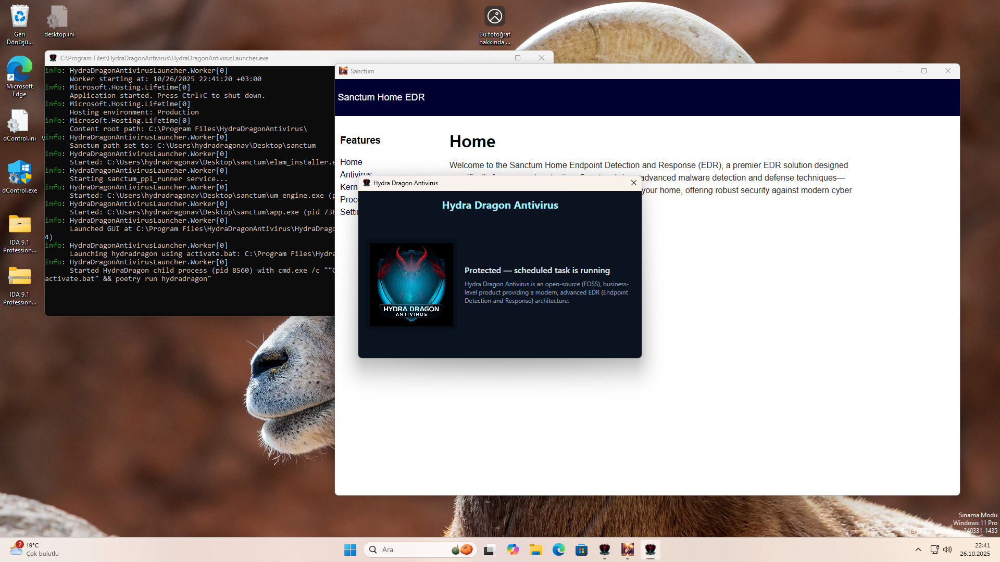

# Hydra Dragon Antivirus

## Description
Dynamic and static analysis with Real Time Protection for Windows, including EDR, ClamAV, YARA-X, custom machine learning AI, behavioral analysis, NLP-based detection, website signatures, Ghidra, Suricata, Sigma, and much more than you can imagine.

## License

This project is licensed under the **GNU Affero General Public License v3.0** (AGPLv3).  
See the [LICENSE](./LICENSE) file for more information.

## MEGA IMPORTANT
- Like in modern antiviruses this antivirus also directly removes threats, so be careful!
- Pe header removed: https://www.virustotal.com/gui/file/9b7e921e971fe7523ba83a4599b4006ad214854eb043372129e4f5a68c5a427f
- Original: https://www.virustotal.com/gui/file/1ef6c1a4dfdc39b63bfe650ca81ab89510de6c0d3d7c608ac5be80033e559326
- So we ignore files looks like junk data (fully unknown)
- What is the difference and why does YARA still flag it as malware? Because your YARA rule doesn't check for unknown file types and I only removed the pe header and went to detections 0. So this god mode rule will save this antivirus right now!
- Please allow a minimum of two hours (local time) for the antivirus to fully decompile the file and complete its analysis. Otherwise, it cannot achieve a 90%+ detection rate against fresh samples with fewer false positives.

## Download Machine Learning Malware And Benign Database
- **Malware Database:** [Download Link](https://drive.google.com/file/d/1QwdxdwX_nH-oF-5hVTkbTuFkrwUfR0-h)
- **Benign Database:** [Download Link](https://drive.google.com/file/d/12L1s4FC3tGmxhrzi_Q1VTgPy6l7S4Hwe)
- **Note:** Only contains PE files and my USB still broken so some Benign Database not exist which I have.
- **Password:** infected

## Machine Learning Training Guide
- Install malicious (datamaliciousorder) and benign (data2) database, then install requirements.txt from train.py and just run train.py with the same folder as datamaliciousorder and data2.
- Then delete results.pkl and rename ml_definitions.pkl to results.pkl to consolidate the pickled data.

## Guide to compiling from source
- You can compile YARA-X and YARA from the yara folder. The website database is not a complication. See the machine learning training guide to compile machine learning database. To compile antivirus.py install requirements.txt and use assets/HydraDragonAV.png then change based on your installed folder of HydraDragonAntivirus. After compiling Machine Learning, YARA then look at the compiler.iss and replace the code with your installed environment, you can find other files in repo like hydradownload folder and then compile it. It's done! Now you are ready to release your fork of HydraDragonAntivirus.

## Ghidra Source Code
- I now using 11.4.2: https://ghidra-sre.org/

## Java Development Kit
- Just look at https://www.oracle.com/java/technologies/downloads/#jdk21-windows

## Setup
- Setup file on release HydraDragonAntivirus.exe

## Ghidra
- Ghidra: %ProgramFiles%\aHydraDragonAntivirus\hydradragon\ghidra
- Ghidra Run: %ProgramFiles%\aHydraDragonAntivirus\hydradragon\ghidra\ghidraRun.bat
- Ghidra log: %ProgramFiles%\aHydraDragonAntivirus\hydradragon\ghidra_logs\analyze.log
- Ghidra projects : %ProgramFiles%\aHydraDragonAntivirus\hydradragon\ghidra_projects
- Ghidra scripts: %ProgramFiles%\aHydraDragonAntivirus\hydradragon\scripts
 
 ## Sigma-HQ - Hayabusa
 - https://github.com/Yamato-Security/hayabusa

 ## IMPORTANT
- Any logs will be removed when you restart the programme. So be careful!
- You have to restart the program after the analysis.
- Please don't share your IP in the logs.
- Make sure that the ClamAV database is installed without problems.
- We strongly recommend that you take a snapshot and then go back when you have finished your work.
- Make your username hydradragonav (for example and for avoid anti analysis).
- The installer also includes daily.cvd, main.cvd, bytecode.cvd due to download issues with the ClamAV database.

 ## Discord Community Server

- Here is the server link: https://discord.gg/Rdyw59xqMC

## Prepare environment
- Create too many files to detect ransomware.

## Guide

**Note 1:**.
- Allow Java on the Windows firewall, as it'll decompile the PE file.

**Note 2:**
- If you find an issue, please create an issue. Antivirus software might be triggered by website signatures because they are not obfuscated, so exclude the `%ProgramFiles%\aHydraDragonAntivirus\hydradragon` folder. Due to risks please only use in a VM.

**Note 3:**

- https://github.com/icsharpcode/ILSpy
- https://github.com/extremecoders-re/nuitka-extractor
- https://github.com/horsicq/Detect-It-Easy
- https://github.com/extremecoders-re/decompyle-builds
- https://github.com/mandiant/gostringungarbler
- https://github.com/cod3nym/Deobfuscar
- https://github.com/fesh0r/fernflower
- https://github.com/ViRb3/de4dot-cex
- https://www.rathlev-home.de/index-e.html?tools/prog-e.html#unpack 
- https://github.com/myfreeer/7z-build-nsis
- https://github.com/upx/upx
- https://github.com/syssec-utd/pylingual
- https://github.com/glmcdona/Process-Dump/releases/tag/v2.1.1
- https://github.com/lifenjoiner/ISx/releases/tag/v0.3.11
- https://github.com/nazywam/AutoIt-Ripper
- https://github.com/SychicBoy/NETReactorSlayer
- https://github.com/Veysel072/VMPUnpacker
- https://github.com/MadMin3r/UnconfuserEx
- https://github.com/LockBlock-dev/pkg-unpacker
- https://github.com/j4k0xb/View8
- https://github.com/HydraDragonAntivirus/MegaDumper 
- https://github.com/GuardianN06/SourceUndefender
- https://github.com/Lil-House/Pyarmor-Static-Unpack-1shot

- I used these projects to decompile (with a current custom database of Detect-It-Easy).

- https://github.com/starhopp3r/ML-Antivirus
- https://github.com/HydraDragonAntivirus/yarGen

- I used these projects for AI.

- https://github.com/HydraDragonAntivirus/Owlyshield
- https://github.com/HydraDragonAntivirus/Sanctum

- I used these projects for EDR.

- https://github.com/clamwin/python-clamav

- https://github.com/HydraDragonAntivirus/PYAS_Protection
- I used these projects to protect the antivirus.

- I used these projects to optimize the antivirus.

**Note 4:**.
- You will need an internet connection to install. It's not an offline installer.

**Note 5:**

- Don't forget to do a clean up, as it takes up too much space while processing files against ransomware, etc. 
- You need too much storage because it logs everything. 

**Note 6:**

- I have collected every malicious IP, domain from the Internet. So there must be big false positives, but I handle them.

**Note 7:**
- I added en_core_web_md manually to %ProgramFiles%\aHydraDragonAntivirus\hydradragon you can find the spacy path from codechecker\spacyfind.py but you need to rename en_core_web_md folder name which contains config.cfg for an example if version 3.7.1 then it contains a subfolder en_core_web_md.3.8.0 
- Also you need run "spacy download en_core_web_md"

**Note 8:**

- If you are testing a rootkit, please do not enable "bcdedit testsigning on" to run the rootkit on your machine for analysis. We will take care of that.

**Note 9:**
- Inno Setup version 6.5.4

## Tips

**Tip 1:**

- Don't use suspicious VM names on your machine. (John Doe, etc.)

**Tip 2:**

- Use VSCode, VSCodium, or another editor to see live changes to .log files if you're on Windows 10, because Windows 11 Notepad automatically detects changes.

**Tip 3:**

- Close the Windows Firewall on the VM to avoid any firewall blocking. We are testing antivirus not Windows Firewall.

**Tip 4:**

- Try reset the container if malware tries to reboot the PC.

### FAQ:
**Does this collect data?**
- No. We can allow GridinSoft and many other companies to collect data. Unlike other companies, they freely allow the use of their cloud, but I'm not allowing that.

**How do I use it?**
- Just run the shortcut from the desktop, then run advanced dynamic and static analysis on a file.

**How good is it?**
- It's very good at static analysis, better than Dr.Web and Comodo, but Norton and Kaspersky are on par with my product at static analysis. In dynamic analysis, it is excellent at detecting unknown malware and clearly better than ClamAV in static analysis. ClamAV doesn't have dynamic analysis. It's the best Turkish and open source malware analysis product but it's very aggressive.

**Why does my antivirus detect this as malware?**
- It's a false positive. It's contains the website, HIPS signatures without obfuscation. It's a fully open source antivirus product.

**Why is it 2GB+?**
- Because of website signatures, Ghidra, ClamAV and Java Development Kit. Website signatures are not very effective but they can detect old and new viruses. I can remove them if you want. Ghidra is for decompiling but takes too much space. Java Development Kit is for Ghidra. That's 1GB+ Note that it's a completely local (except update database) and professional open source antivirus.

**Why does the antivirus.exe application take too long to run?**
- Sometimes you may have to wait 5+ minutes (or less) the first time you run the programme as a lot of things load.

**Which Windows versions are supported?**
- (Python 3.12 is required because spaCy does not yet have a stable release for Python 3.13.) Windows 10 64-bit and Windows 11 only (you can run ClamAV, but you can't run HydraDragonAntivirus on Windows 8.1 and it's not supported). If you want, I can create a 32-bit version for Windows 10 32-bit, but I faced some problems. ClamAV has limitations on 32-bit, so it's problematic. On Windows 8.1, ClamAV isn't supported because it's an outdated Windows version. You will get the `api-ms-win-crt-runtime-l1-1-0.dll` error. Even if you add this DLL, you will get another error: "Application failed to start properly (0xc000007b)." Then install this: [Microsoft VC Redist](https://learn.microsoft.com/en-us/cpp/windows/latest-supported-vc-redist?view=msvc-170). After running `%ProgramFiles%\ClamAV\freshclam.exe` and `clamd.exe` with `clamd --install`, the setup is complete, but you can't run HydraDragonAntivirus on Windows 8.1 because you get an ImportError on line nine due to PySide6.
- If you still want support for Windows 7, you will need to manually downgrade to Python 3.8 and many tools. 32-bit support is possible. Although Windows XP support is possible through the One Core API.

**What are the minimum RAM and disk space requirements?**

- A minimum of 8 GB of RAM is required: 3 GB is used by ClamAV, and the remaining 5 GB is used by other engines.

**Any sponsors or supporters?**
- Yes, there are supporters for this project. Xcitium (Comodo) has expressed interest in supporting this project by providing malware samples, and Cisco Talos ClamAV community projects. But it's still a one man project.

**Are you using leaked YARA rules?**
- No we don't but if you have proof please create issue we can remove it.

**Why don't you use NictaSoft, GridinSoft and Bitdefender cloud?**
- It could significantly boost my antivirus. However, there are some problems. These services are not open source unless you pay. We're not only focused on detection, but also committed to maintaining open-source principles.

**Other related things?**
- I used yarGen to create machinelearning.yar.

**How many repositories did you look at for this project?**
- For YARA and website signatures, I looked at many projects-possibly more than 1,000.

**Why doesn't the program open?**
- Your installation might be broken. You can check the logs to determine the issue, because if the connection was lost during installation, it can affect the installation significantly. Try reinstalling to fix the problem.

### Credits:
- All credits goes to Emirhan Uçan
- Thanks to Hacı Murad for collecting and compiling machine learning signatures.
