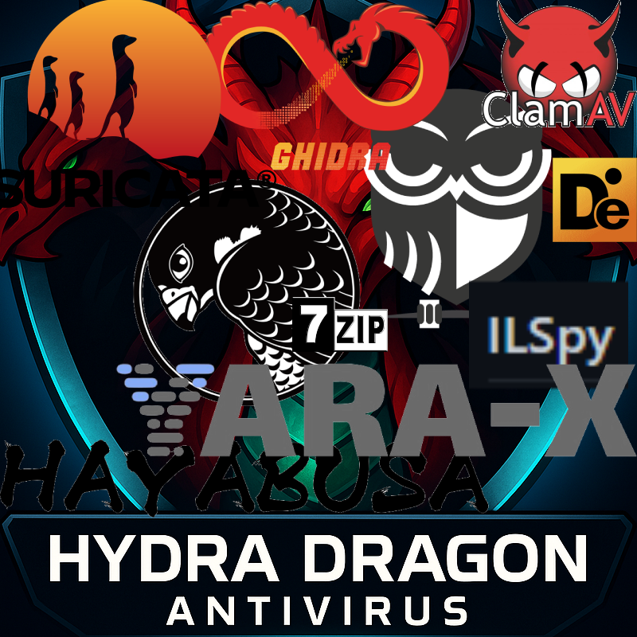

# Hydra Dragon Antivirus

Dynamic and Static Analysis with Sandboxie for Windows with ClamAV, YARA-X, my machine learning AI, Behaviour analysis, NLP-Based detection, website signatures, Ghidra and Snort etc.

## MEGA IMPORTANT
- You have to set (manually of course) this part mega_optimization_with_anti_false_positive=True if you don't care about false positives and optimization. This setting is true because every antivirus on virustotal avoids false positives this way.
- Pe header removed: https://www.virustotal.com/gui/file/9b7e921e971fe7523ba83a4599b4006ad214854eb043372129e4f5a68c5a427f
- Original: https://www.virustotal.com/gui/file/1ef6c1a4dfdc39b63bfe650ca81ab89510de6c0d3d7c608ac5be80033e559326
- What is the difference and why does YARA still flag it as malware? Because your YARA rule doesn't check for unknown file types and I only removed the pe header and went to detections 0. So this god mode rule will save this antivirus right now!
- If you want Meta Llama 3.2-1B, you need to download it from the releases. We didn't include the optional feature to reduce size.

## Download Machine Learning Malware And Benign Database
- **Malware Database:** [Download Link](https://drive.google.com/file/d/1QwdxdwX_nH-oF-5hVTkbTuFkrwUfR0-h)
- **Benign Database:** [Download Link](https://drive.google.com/file/d/1JXcTVB205tJXqNmFWmnAiy1br_hn19Rj)
- **Note:** Only contains PE files.
- **Password:** infected

## Machine Learning Training Guide
- Install malicious (datamaliciousorder) and benign (data2) database, then install requirements.txt from train.py and just run train.py with the same folder as datamaliciousorder and data2.

## Guide to compiling from source
- You can compile YARA-X and YARA from the yara folder. The website database is not a complication. See the machine learning training guide to compile machine learning database. To compile antivirus.py install requirements.txt and use assets/HydraDragonAV.png then change based on your installed folder of HydraDragonAntivirus. After compiling Machine Learning, YARA then look at the compiler.iss and replace the code with your installed environment, you can find other files in repo like hydradownload folder and then compile it. It's done! Now you are ready to release your fork of HydraDragonAntivirus.

## Ghidra Source Code
- I now using 11.4: https://ghidra-sre.org/

## Java Development Kit
- Just look at https://www.oracle.com/java/technologies/downloads/#jdk21-windows

## Setup
- Setup file on release HydraDragonAntivirus.exe

## Logs
- You must look warnining at logs. They usually contain malware detections. Log file in %ProgramFiles%\aHydraDragonAntivirus\hydradragonantivirus\log\antivirus.log and C:\Sandbox\yourusername\DefaultBox\drive\C\DONTREMOVEHydraDragonAntivirusLogs

## Ghidra
- Ghidra: %ProgramFiles%\aHydraDragonAntivirus\hydradragonantivirus\ghidra
- Ghidra Run: %ProgramFiles%\aHydraDragonAntivirus\hydradragonantivirus\ghidra\ghidraRun.bat
- Ghidra log: %ProgramFiles%\aHydraDragonAntivirus\hydradragonantivirus\ghidra_logs\analyze.log
- Ghidra projects : %ProgramFiles%\aHydraDragonAntivirus\hydradragonantivirus\ghidra_projects
- Ghidra scripts: %ProgramFiles%\aHydraDragonAntivirus\hydradragonantivirus\scripts
 
 ## IMPORTANT
 - Any ghidra project will be removed after you restart the program. So be careful!
 - Don't forget to clean up commandlineandmessages, HiJackThis_logs, zip_extracted, etc. dirs, sandboxie dirs before analysis. Or take a snapshot before you running the program.
 - You have to restart the program after the analysis.
- Please don't share your IP in the logs.
- Make sure that the ClamAV database is installed without problems.
- We strongly recommend that you take a snapshot and then go back when you have finished your work.
- Don't forget to take a HiJackThis report with logs (and update the signatures first) before starting the scan to detect malware for the final analysis.
- The final analysis doesn't clean anything, so don't start a new scan afterward it's only for detecting post-injection changes using HiJackThis. Please don't terminate the sandbox environment.
- The new HiJackThis analysis removes the previous analysis file from the sandbox environment.
- Make your username hydradragonav (for example).
- Don't forget to create the 'DefaultBox' folder if it was deleted, by right-clicking on Sandboxie Control and selecting 'Explore Contents'.
- The installer also includes daily.cvd, main.cvd, bytecode.cvd due to download issues with the ClamAV database.
- Please allow a minimum of two hours (your local time) for the antivirus to fully decompile the file and complete its analysis.

 ## Discord Community Server

- Here is the server link: https://discord.gg/Rdyw59xqMC

## Prepare environment
- Create too many files to detect ransomware.

## Guide

**Note 1:** 
- You need to create a DefaultBox in Sandboxie by running it once with a random application.  Also, please clean the DefaultBox items each time you scan.

**Note 2:** 
- You must run ghidra before you run Hydra Dragon Antivirus. To run ghidra, simply open this file:  %ProgramFiles%\aHydraDragonAntivirus\hydradragonantivirus\ghidra\ghidraRun.bat

**Note 3:**.
- Allow Java on the Windows firewall, as it'll decompile the PE file.

**Note 4:**
- The update can take up to 5 minutes (10 seconds depending on your internet speed) or more, and will happen if you open this application after 6 hours, as it updates ClamAV definitions. Wait until you receive an update message. You can view freshclam.exe in the Task Manager under Hydra Dragon Antivirus. It will also restart ClamAV after definitions then give you a message. It's not well tested. If you find an issue, please create an issue. Antivirus software might be triggered by website signatures because they are not obfuscated, so exclude the `%ProgramFiles%\aHydraDragonAntivirus\hydradragonantivirus` folder. Please only use in a VM as you can only use this for deep analysis of a file. There is no fixed analysis time for a file.

**Note 5:**

- https://github.com/icsharpcode/ILSpy
- https://github.com/extremecoders-re/nuitka-extractor
- https://github.com/horsicq/Detect-It-Easy
- https://github.com/extremecoders-re/decompyle-builds
- https://github.com/mandiant/gostringungarbler
- https://github.com/cod3nym/Deobfuscar
- https://github.com/fesh0r/fernflower
- https://github.com/ViRb3/de4dot-cex
- https://www.rathlev-home.de/index-e.html?tools/prog-e.html#unpack 
- https://github.com/myfreeer/7z-build-nsis
- https://github.com/upx/upx
- https://github.com/syssec-utd/pylingual
- https://github.com/glmcdona/Process-Dump/releases/tag/v2.1.1
- https://github.com/lifenjoiner/ISx/releases/tag/v0.3.11

- I used these projects to decompile (with a current custom database of Detect-It-Easy).

- https://github.com/starhopp3r/ML-Antivirus
- https://huggingface.co/meta-llama/Llama-3.2-1B

- I used these projects for AI.

**Note 6:**.
- You will need an internet connection to install. It's not an offline installer.

**Note 7:**

- Don't forget to do a clean up, as it takes up too much space while processing files against ransomware, etc. 
- You need too much storage because it logs everything. 

**Note 8:**

- I have collected every malicious IP, domain from the Internet. So there must be big false positives, but I handle them.

**Note 9:**
- I added en_core_web_md manually to %ProgramFiles%\aHydraDragonAntivirus\hydradragonantivirus you can find the spacy path from codechecker\spacyfind.py but you need to rename en_core_web_md folder name which contains config.cfg for an example if version 3.7.1 then it contains a subfolder en_core_web_md.3.8.0 
- Also you need run "spacy download en_core_web_md"

**Note 10:**

- If you are testing a rootkit, please do not enable "bcdedit testsigning on" to run the rootkit on your machine for analysis. We will take care of that.

**Note 11:**
- HiJackThis version: 3.4.0.17 Beta
- HiJackThis source code: https://github.com/dragokas/hijackthis

**Note 12:**
- HydraDragonAntivirusSandboxie vcpkg install commandds:
- vcpkg install detours
- vcpkg install libarchive
- vcpkg integrate install

**Note 13:**
- Inno Setup version 6.4.3

## Tips

**Tip 1:**

- Don't use suspicious VM names on your machine. (victim, etc.)

**Tip 2:**

- Use VSCode, VSCodium, or another editor to see live changes to .log files if you're on Windows 10, because Windows 11 Notepad automatically detects changes.

**Tip 3:**

- Close the Windows Firewall on the VM to avoid any firewall blocking.

**Tip 4:**

- Try reset the container if malware tries to reboot the PC.

**Tip 5:**

- Run HiJackThis once outside of the sandbox to avoid being asked to accept the license agreement every time.

**Tip 6:**

- If Your program requires command-line arguments. Follow these steps:

- 1. Run the program normally. It will exit immediately because no arguments were supplied.
- 2. Open Sandboxie Control, right-click the DefaultBox, and select Run Any Program.
- 3. Browse to the application executable.
- 4. Enter the required arguments in the **Command line** field.
- 5. Click **OK** to launch the program inside Sandboxie with the correct arguments.

## Internet Access In Sandboxie
- HIPS detection shouldn't work if you don't open the internet in Sandboxie (the installation already changes Sandboxie.ini for you). To enable it go to: Sandbox -> DefaultBox -> Sandbox Settings -> Restrictions -> Internet Access -> Click "BLock All Programs" then click "Allow All Programs" then save it and you're done!.  https://sandboxie-plus.com/sandboxie/restrictionssettings/

### FAQ:
**Does this collect data?**
- No. We can allow GridinSoft and many other companies to collect data. Unlike other companies, they freely allow the use of their cloud, but I'm not allowing that.

**How do I use it?**
- Just run the shortcut from the desktop, then run advanced dynamic and static analysis on a file.

**How good is it?**
- It's very good at static analysis, better than Dr.Web and Comodo, but Norton and Kaspersky are on par with my product at static analysis. In dynamic analysis, it is excellent at detecting unknown malware and clearly better than ClamAV in static analysis. ClamAV doesn't have dynamic analysis. It's the best Turkish and open source malware analysis product but it's very aggressive.

**Why does my antivirus detect this as malware?**
- It's a false positive. It's contains the website, HIPS signatures without obfuscation. It's a fully open source antivirus product.

**Why is it 2GB+?**
- Because of website signatures, Ghidra, ClamAV and Java Development Kit. Website signatures are not very effective but they can detect old and new viruses. I can remove them if you want. Ghidra is for decompiling but takes too much space. Java Development Kit is for Ghidra. That's 1GB+, but Llama3.2-1B make a total of 3GB+. Note that it's a completely local (except update database and cloud checking for known files) and professional open source antivirus.

**Why does the antivirus.exe application take too long to run?**
- Sometimes you may have to wait 5+ minutes (or less) the first time you run the programme as a lot of things load.

**Which Windows versions are supported?**
- (Python 3.12 is required because spaCy does not yet have a stable release for Python 3.13.) Windows 10 64-bit and Windows 11 only (you can run ClamAV, but you can't run HydraDragonAntivirus on Windows 8.1 and it's not supported). If you want, I can create a 32-bit version for Windows 10 32-bit, but I faced some problems. ClamAV has limitations on 32-bit, so it's problematic. On Windows 8.1, ClamAV isn't supported because it's an outdated Windows version. You will get the `api-ms-win-crt-runtime-l1-1-0.dll` error. Even if you add this DLL, you will get another error: "Application failed to start properly (0xc000007b)." Then install this: [Microsoft VC Redist](https://learn.microsoft.com/en-us/cpp/windows/latest-supported-vc-redist?view=msvc-170). After running `%ProgramFiles%\ClamAV\freshclam.exe` and `clamd.exe` with `clamd --install`, the setup is complete, but you can't run HydraDragonAntivirus on Windows 8.1 because you get an ImportError on line nine due to PySide6.
- If you still want support for Windows 7, you will need to manually downgrade to Python 3.8 and many tools. 32-bit support is possible. Although Windows XP support is possible through the One Core API.

**What are the minimum RAM and disk space requirements?**

- Maximum Features (without Meta Llama 3.2-1B):
- 4 GB of RAM is the minimum requirement because Meta Llama 3.2-1B is not being used.

- Maximum Features (with Meta Llama 3.2-1B):
- 8 GB of RAM is the minimum requirement because Meta Llama 3.2-1B is running locally. I strongly recommend at least 8 GB of RAM, 10 GB of free disk space, and a minimum of four processor cores.

**Any sponsors or supporters?**
- Yes, there are supporters for this project. Xcitium (Comodo) has expressed interest in supporting this project by providing malware samples, and Cisco Talos ClamAV community projects. But it's still a one man project.

**Are you using leaked YARA rules?**
- No we don't but if you have proof please create issue we can remove it.

**Why don't you use NictaSoft, GridinSoft and Bitdefender cloud?**
- It could significantly boost my antivirus. However, there are some problems. These services are not open source unless you pay. We're not only focused on detection, but also committed to maintaining open-source principles.

**Other related repositories?**
- I used https://github.com/HydraDragonAntivirus/yarGen to create machinelearning.yar.

### Credits:
- All credits goes to Emirhan Uçan
